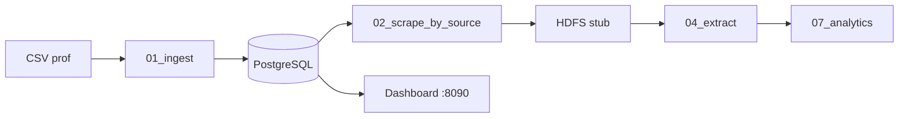

# Plateforme entreprises belges — Airflow (TP groupe)

Orchestration **Apache Airflow** + Python (`packages/`) pour ingérer, scraper, structurer et superviser des données publiques belges (BCE / KBO, Moniteur, BNB).

## Par où commencer ?

| Besoin | Document |
|--------|----------|
| **Utiliser / démo / rendu** | **[`GUIDE.md`](GUIDE.md)** ← guide principal en français |
| Développement technique | [`README_DEV.md`](README_DEV.md) |
| Matrice sujet PDF ↔ preuves | [`LIVRABLE.md`](LIVRABLE.md) |
| Ordre des DAGs | [`airflow/dags/RUN_ORDER.md`](airflow/dags/RUN_ORDER.md) |
| Spécifications (EN) | [`doc.EN/README.md`](doc.EN/README.md) |

## Démarrage rapide

```bash
cd infra && export AIRFLOW_UID=$(id -u) && docker compose up -d
cd .. && ./scripts/db-migrate.sh
```

| Interface | URL |
|-----------|-----|
| **Dashboard** (supervision) | http://127.0.0.1:8090/ |
| **Airflow** | http://localhost:8080/ (`airflow` / `airflow`) |

**Démo 5 min** (ingest déjà fait si ~3,6 M entreprises en base) :

```bash
cd infra
docker compose exec -T airflow-scheduler airflow dags trigger 08_full_pipeline \
  --conf '{"limit":8,"wire_bridge":true}'
# puis 07_analytics_refresh, dashboard : ../scripts/run-dashboard.sh
```

Ou script : [`scripts/demo-e2e.sh`](scripts/demo-e2e.sh).

## Pipeline (vue d’ensemble)



- **Scrape standard** : `02_scrape_by_source` (4 tasks parallèles, un site chacune).
- **Ne pas relancer** `01_ingest_csv` si les millions de lignes sont déjà en base.

## État du livrable

| Zone | État |
|------|------|
| Ingestion CSV → PostgreSQL | ✅ |
| Scrape multi-sources + HDFS stub | ✅ |
| Extraction / discovery / lifecycle / analytics | ✅ MVP |
| Dashboard + détail entreprise (FR) | ✅ |
| Scrape national 3,6 M × 5 URLs | ⚠️ lots `limit` répétés (hors délai démo) |

**Tests :** `pytest tests/ -q`

## Scripts

Voir [`scripts/README.md`](scripts/README.md).

## Limites connues (documentées)

- **HDFS** : stub local (`data/hdfs-stub/`), pas un cluster Hadoop.
- **Extraction** : MVP — tous les champs du PDF sujet ne sont pas couverts.
- **Pools** : `scrape_parallel_pool` = 4 slots pour le parallélisme des 4 sites.
