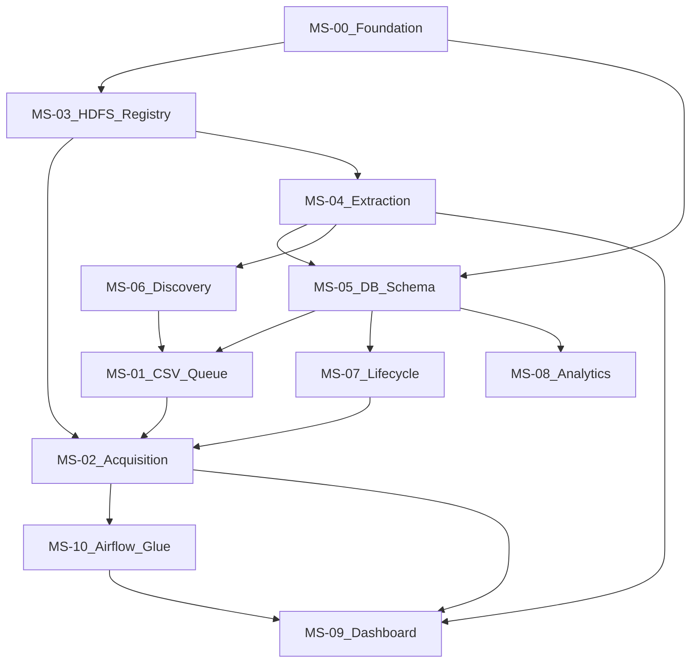

# Execution order (strict) — build one microservice at a time

Follow this order unless your teacher forces a different integration path. The goal is **minimize rework**: later services depend on earlier **frozen contracts**.

## Phase A — Foundations (infra contracts)

1. **`MS-00` Platform foundation**  
   Airflow runtime, configuration, logging baseline, secrets layout, local/dev dependencies.

2. **`MS-03` Raw object store (HDFS) + path conventions**  
   You can stub HDFS locally (e.g., MinIO “HDFS-like” only if allowed; otherwise Hadoop pseudo-distributed as required).  
   **Freeze**: raw path layout + metadata sidecar format.

3. **`MS-05` Database schema (minimal first)**  
   Start with tables needed for **queue + provenance + audit** before complex analytics tables.  
   **Freeze**: enterprise identity, processing states, raw document registry, discovery edges.

## Phase B — Data motion (the vertical slice)

4. **`MS-01` CSV ingestion + work queue**  
   Seed enterprises, dedupe, normalization of enterprise numbers.

5. **`MS-02` Acquisition / scraping**  
   Download, proxy policy, validation, metadata envelope, write raw bytes + metadata.

6. **`MS-10` Orchestration DAGs (thin glue)**  
   Wire: ingest → scrape → extract → load → lifecycle tick → analytics refresh.  
   Keep DAGs **thin**: operators call service modules.

## Phase C — Intelligence

7. **`MS-04` Extraction / parsing**  
   HTML in → structured JSON/rows out (schema-versioned).

8. **`MS-06` Dynamic discovery**  
   Detect enterprise numbers in parsed graphs; enqueue with provenance.

9. **`MS-07` Lifecycle + freshness**  
   Scheduling rules, rescrape selection, status transitions, “no deletes” policy.

10. **`MS-08` Analytics jobs**  
    Periodic aggregates/materializations.

## Phase D — Observability

11. **`MS-09` Monitoring dashboard**  
    Real-time metrics; depends on metrics emitted from MS-02/04/05/07 and/or Airflow callbacks.

## Dependency graph (high level)

## “One AI per step” practical tip

When prompting an AI, always attach:

- The target `MS-xx` file
- The **frozen** excerpts from `contracts/public-interfaces.md` that your step may call or implement
